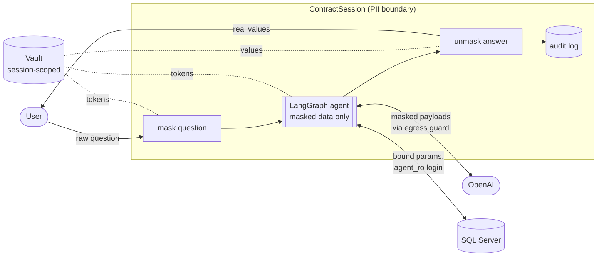
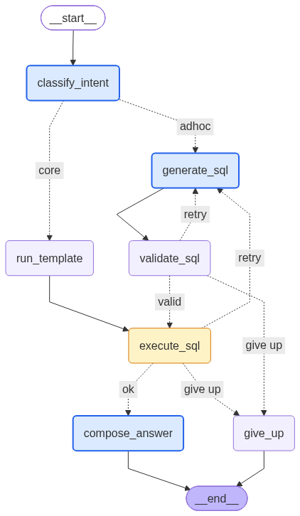
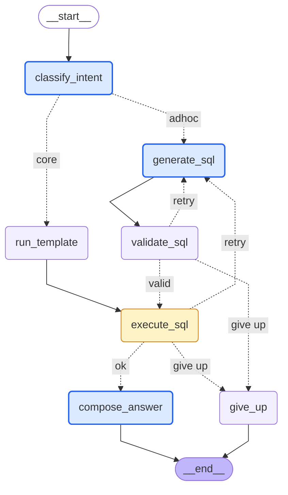

# Contract Query Agent

LangGraph agent that answers questions about one lease/loan contract by running read-only SQL against SQL Server,
with PII governance: no raw personal data is ever sent to the LLM.
Spec: https://claude.ai/code/artifact/9ee2d630-f0f8-4c17-a22d-d228c2acf13c

## How a question flows



1. **Open** (once per contract): resolve the sequence number, create a vault, and load the contract's customer
   profile (names, email, phone, address, zip; never SSN) as *known values*.
2. **Mask the question**: regex (SSN, card, email, phone), known values, and Presidio NER for other names.
   `john.carter@example.com` becomes `<EMAIL_1>`.
3. **Run the graph** on masked data. `execute_sql` masks rows as it fetches them, using SQL lineage to classify
   output columns, so `FirstName + ' ' + LastName AS CustomerName` is still masked.
4. **Egress guard**: every LLM payload is re-scanned before it leaves; anything found is masked and audited.
5. **Unmask the answer** for the user (SSN stays `[REDACTED]`), and write one audit record.

## Agent graph



Blue nodes call the LLM; the amber node fetches and masks query results in one step, so raw rows never enter graph
state. Core questions go through `run_template` (vetted SQL); everything else goes `generate_sql` → `validate_sql`,
with up to 2 repair retries before `give_up`.

<details>
<summary>Mermaid source (renders on GitHub)</summary>



</details>

Both files are generated from the compiled graph, so they always match the code. Regenerate after changing
`agent/graph.py`:

```powershell
.\.venv\Scripts\python scripts\draw_graph.py   # writes docs/agent_graph.mmd and docs/agent_graph.png
```

## PII governance

Full write-up: [PII implementation details](docs/PII%20implementation%20details.md).

| Control | Where | What it guarantees |
| --- | --- | --- |
| Policy file | `governance/policy.yaml` | Column classification, reveal rules, detectors, allow-list, guard mode; no code change to adjust |
| Contract scoping | `agent/validator.py` | Every SELECT must filter a contract key and join other tables by foreign keys, so other customers' data is never fetched |
| Restricted columns | validator + `DENY SELECT` for `agent_ro` | SSN can never be selected |
| Input masking | `ContractSession.ask` | Questions are masked before the graph sees them |
| Row masking | `execute_sql` + `governance/lineage.py` | Results are masked at fetch time; lineage traces aliases and expressions to source columns |
| Stable tokens | `governance/vault.py` | The same value always maps to the same token in a session, so the LLM can still compare values |
| Vault isolation | `VaultStore` | The token map lives outside graph state, logs and payloads; it fails closed and is wiped on close or expiry |
| Egress guard | `governance/guard.py` | Last re-scan of every LLM payload; `mask` (default) or `block` mode |
| Reveal policy | `PiiMasker.unmask` | Users see real names and contact details; SSN and card numbers stay `[REDACTED]` |
| Audit log | `logs/audit.jsonl` | One JSON record per question: masked text, SQL, PII counts, LLM call hashes, latency; no raw PII |

## Setup

1. Database: see `db/README.md` (schema, seed, read-only login `agent_ro`).
2. Python environment:
   ```powershell
   python -m venv .venv
   .\.venv\Scripts\pip install langgraph langchain-openai sqlalchemy pyodbc sqlglot python-dotenv pyyaml presidio-analyzer pytest
   .\.venv\Scripts\python -m spacy download en_core_web_sm
   ```
3. `.env` in the project root (git-ignored):
   ```
   DB_CONNECTION_STRING=Driver={ODBC Driver 17 for SQL Server};Server=RAVICHANDRA;Database=Auto;Uid=agent_ro;Pwd=...;TrustServerCertificate=yes;
   OPENAI_API_KEY=...
   OPENAI_MODEL=gpt-4o-mini
   # AS_OF_DATE=2026-10-01   optional: pin "today" for repeatable demos
   ```

## Use

```powershell
.\.venv\Scripts\python -m agent.cli CT-1001                      # chat
.\.venv\Scripts\python -m agent.cli CT-1003 -q "What is Maria Lopez's phone number?" --as-of 2026-10-01 --show-masked
```

`--show-masked` prints what the LLM actually saw, e.g. `What is <PERSON_1>'s phone number?`.

## Test

```powershell
.\.venv\Scripts\python -m pytest            # offline (191): validator, governance, PII leak, templates, graph
.\.venv\Scripts\python -m pytest -m live -s # live OpenAI: 8 core + 12 ad-hoc + 4 PII questions, payloads checked
```

The PII leak tests record every payload that would go to the LLM and fail if any seeded customer value appears in it
or in the audit log. The live tests do the same with the real payloads sent to OpenAI.

## Layout

| Path | What |
| --- | --- |
| `agent/session.py` | `ContractSession`: the PII boundary (mask, run graph, unmask, audit) |
| `agent/graph.py` | LangGraph wiring |
| `agent/nodes.py` | Node functions; LLM only in classify, generate SQL, compose, always via the egress guard |
| `agent/state.py` | Graph state (masked data only) |
| `agent/templates.py` | Vetted SQL for the four core questions and the customer profile |
| `agent/validator.py` | sqlglot safety and contract-scoping checks ([explained](docs/SQLValidator%20using%20SQLGlot.md)) |
| `agent/schema.py` | Tables, columns, contract keys and foreign keys |
| `agent/prompts.py` | Schema card, few-shot examples, prompts |
| `agent/db.py` | Read-only engine, timeout, row cap |
| `agent/cli.py` | Command-line chat |
| `governance/` | Policy, vault, detectors, masker, lineage, egress guard, audit |
| `tests/` | Offline tests + live eval |
| `scripts/draw_graph.py` | Renders the graph diagram into `docs/` |
