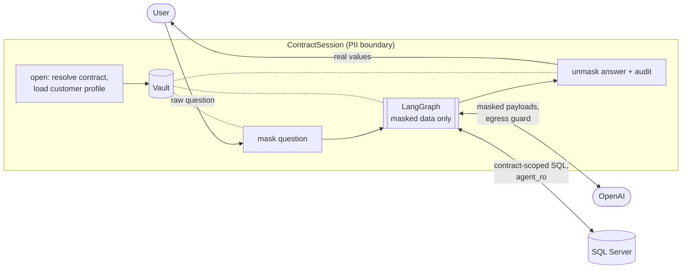

# PII implementation details

How the contract agent keeps personal data away from the LLM (OpenAI) while still answering questions about it.

**Guarantee:** no raw value from a PII column, and no PII typed by the user, is sent to the LLM or written to the
audit log. The end user still receives real values in the final answer, except restricted data (SSN, card numbers),
which is never shown.

## 1. What counts as PII

Defined in `governance/policy.yaml`, not in code.

| Source | Entity type | LLM sees | User sees |
| --- | --- | --- | --- |
| `Customers.FirstName`, `LastName` | PERSON | `<PERSON_1>` | real value |
| `Customers.Email` | EMAIL | `<EMAIL_1>` | real value |
| `Customers.Phone` | PHONE | `<PHONE_1>` | real value |
| `Customers.AddressLine1`, `AddressLine2` | ADDRESS | `<ADDRESS_1>` | real value |
| `Customers.Zip` | ZIP | `<ZIP_1>` | real value |
| `Customers.SSN` | SSN (restricted) | never fetched; typed SSNs become `<SSN_1>` | `[REDACTED]` |
| Card numbers typed by the user | CREDIT_CARD | `<CREDIT_CARD_1>` | `[REDACTED]` |
| Names typed by the user (not the customer) | PERSON | `<PERSON_n>` | real value |

Amounts, dates, statuses and contract sequence numbers are business data and pass through unchanged.

## 2. Threats addressed

| Threat | Control |
| --- | --- |
| PII in query results sent to the LLM to compose the answer | Row masking at fetch time (section 5.5) |
| PII typed into the question | Input masking (5.4) |
| Column renamed by an alias or expression (`FirstName + ' ' + LastName AS Who`) | SQL lineage classification (5.6) |
| Generated SQL reading other customers' data, which the vault cannot recognise | Contract scoping in the validator (5.2) |
| SSN selected by generated SQL | Restricted column check + database `DENY` (5.1) |
| PII echoed in database error messages fed back to the LLM | Error-text masking (5.5) |
| Anything missed by the layers above | Egress guard on every LLM call (5.7) |
| PII persisted in graph state, traces, checkpoints or logs | Session boundary, vault outside state, masked-only state and audit (4, 5.3, 5.8) |
| PII resent on follow-up turns | History stored masked (5.4) |

## 3. Request lifecycle



Worked example (contract CT-1003, customer Maria Lopez):

| Step | Content |
| --- | --- |
| User asks | `What is Maria Lopez's phone number?` |
| Question after masking | `What is <PERSON_1>'s phone number?` |
| SQL written by the LLM | `SELECT cu.Phone FROM dbo.Customers cu JOIN dbo.LoanFinances ln ON ln.CustomerId = cu.Id WHERE ln.ContractId = :contract_id` |
| Row from the database | `{"Phone": "555-0103"}` |
| Row the LLM sees | `{"Phone": "<PHONE_1>"}` |
| LLM answer | `<PERSON_1>'s phone number is <PHONE_1>.` |
| User receives | `Maria Lopez's phone number is 555-0103.` |
| Audit record | masked question, SQL, `pii_input: {PERSON: 1}`, `pii_masked_output: {PHONE: 1}`, `pii_guard_masked: {}` |

## 4. Architecture decision: masking at the boundary, not in the graph

Masking runs in `agent/session.py` (`ContractSession`), around the graph rather than as graph nodes:

- **The graph only sees masked data.** The question is masked before `app.invoke`, and the answer is unmasked after
  it returns. Every text field in `AgentState` (`agent/state.py`) is masked.
- **The vault is not in graph state.** The state holds only `session_id`; nodes look the vault up in a `VaultStore`.
  State snapshots, LangSmith traces or a future checkpointer therefore cannot contain the token map.
- **Raw rows never enter state.** `execute_sql` fetches and masks in one step and stores only the masked rows.

This replaced the step 3 design, which had `mask_input`, `mask_output` and `unmask_answer` nodes that would have kept
raw values in graph state.

## 5. Components

### 5.1 Restricted columns: SSN can never be selected

- `restricted_columns` in `policy.yaml` lists `Customers.SSN`; `agent/validator.py` reads it into `BLOCKED_COLUMNS` and
  rejects any query that references the column.
- `SELECT *` is rejected (it would include SSN); `COUNT(*)` is allowed.
- The database login `agent_ro` has `DENY SELECT ON dbo.Customers (SSN)`, so even a validator bug cannot read it.
- `CUSTOMER_PROFILE` (`agent/templates.py`), the query that loads the vault, deliberately excludes SSN.

### 5.2 Contract scoping in the SQL validator

Row masking can only mask values it recognises. The vault knows the current contract's customer; it does not know
other customers. So generated SQL must never reach other contracts. `_contract_scope_errors()` in
`agent/validator.py` uses sqlglot's `traverse_scope` to check every SELECT scope (each UNION branch, subquery and CTE)
that reads a table:

1. Its own WHERE or JOIN ... ON must contain `<contract key> = :contract_id`, where the key is one of
   `Contracts.Id`, `LeaseFinances.ContractId`, `LoanFinances.ContractId` or `Receivables.EntityId` (`agent/schema.py`).
   The left side must be a real column; predicates under `NOT` or inside nested subqueries do not count.
2. Every other table must be reached from that anchor through a join in `FOREIGN_KEYS`
   (e.g. `LeaseFinances.CustomerId = Customers.Id`).
3. Receivables also need `EntityType = 'CT'`.

Rejected examples (all in `tests/test_validator.py`):

```sql
SELECT FirstName FROM dbo.Customers WHERE Id = :contract_id                     -- contract id used as customer id
SELECT cu.FirstName FROM dbo.Contracts c, dbo.Customers cu WHERE c.Id = :contract_id   -- cross join
SELECT ... WHERE Id = :contract_id UNION SELECT ... FROM dbo.Contracts          -- unscoped UNION branch
WITH x AS (SELECT cu.Email FROM dbo.Customers cu) SELECT x.Email FROM x         -- unscoped CTE
```

### 5.3 Vault (`governance/vault.py`)

- **Tokens:** `<TYPE_n>`, e.g. `<PERSON_1>`. Stable within a session: the same value (case- and
  whitespace-insensitive) always gets the same token. This lets the LLM answer "is `<EMAIL_1>` the email on file?"
  by comparing tokens without seeing either value.
- **Known values:** at session open, the contract customer's first name, last name, full name, email, phone,
  addresses and zip are registered, so they are masked wherever they appear in free text.
- **Isolation:** `VaultStore` holds one vault per session. `get()` fails closed (unknown or expired session raises
  `KeyError`); vaults expire after an idle TTL (default 1 hour) and are wiped on `close()`.
- **No accidental printing:** `repr(vault)` shows counts only.
- **Production note:** the store is in memory. The interface is designed to be backed by an encrypted, TTL-bound store
  such as Redis.

### 5.4 Input masking (`governance/detectors.py`, `governance/masker.py`)

`PiiMasker.mask_text()` runs three detectors and merges their findings:

| Detector | Finds | Notes |
| --- | --- | --- |
| `RegexDetector` | SSN, card number (Luhn-checked), email, phone (NANP and 7-digit) | Phone pattern refuses digit groups that are part of longer numbers |
| `KnownValueDetector` | The session's known values | Longest first ("John Carter" before "John"), case-insensitive, word boundaries; values under 3 characters only as part of longer ones |
| `NerDetector` | Other person names | Microsoft Presidio + spaCy `en_core_web_sm`, score ≥ 0.6; loaded lazily, disables itself with a warning if not installed |

Overlap resolution (`_resolve`): allow-listed text (status words, `CT-\d+`, etc.) is never masked; text inside an
existing token is never re-masked; on overlap the earliest, then longest, span wins; a trailing possessive `'s` is
kept outside the token.

Conversation history is stored in masked form, so follow-up turns never resend raw values.

### 5.5 Row masking (`execute_sql` in `agent/nodes.py`)

1. `run_query` returns native Python types, so text can be told apart from numbers and dates.
2. `classify_output_columns()` maps output columns to entity types (5.6).
3. `PiiMasker.mask_rows()` tokenizes classified columns; every other **string** cell is scanned with the regex and
   known-value detectors. Numbers, dates and NULLs pass through.
4. Only the masked rows are stored in state.

If the database rejects a query, its error message is masked before it goes back to the LLM for repair.
SQL Server error messages can contain data values, for example "Conversion failed when converting the nvarchar value
'John'...".

### 5.6 SQL lineage classification (`governance/lineage.py`)

Masking by column name alone fails as soon as the LLM aliases a column. `sqlglot.lineage.lineage()` traces each
output column back through aliases, expressions, subqueries and CTEs to source columns, which are looked up in the
policy:

| Query output | Traced to | Classified as |
| --- | --- | --- |
| `cu.FirstName + ' ' + cu.LastName AS CustomerName` | FirstName, LastName | PERSON |
| `UPPER(cu.Phone) AS p` | Phone | PHONE |
| `x.Street AS Addr` from a CTE over `AddressLine1` | AddressLine1 | ADDRESS |

If a column mixes types, a restricted type wins. If lineage cannot be computed, the function returns `None` (unknown,
not "no PII"), and masking relies on value scanning.

### 5.7 Egress guard (`governance/guard.py`)

Every LLM call goes through `AgentNodes._call_llm()`, which first runs `EgressGuard.check()` on the final messages,
including the system prompt, history, rows and any repair prompt. It uses the regex and known-value detectors (fast,
no false positives on SQL or schema text).

- `mask` mode (default): masks findings, continues, and records counts in the audit log.
- `block` mode: raises `PiiLeakError` (types and counts only, never values) and the call is not made.

In normal operation the guard should find nothing; a non-zero `pii_guard_masked` in the audit log means an earlier
layer missed something and should be investigated.

### 5.8 Unmasking and reveal policy

`PiiMasker.unmask()` replaces tokens in the LLM's answer with real values when the entity type has
`reveal_to_user: true`, and with `[REDACTED]` otherwise (SSN, CREDIT_CARD). Tokens the vault does not know are
left as written.

### 5.9 Audit log (`governance/audit.py`)

`logs/audit.jsonl`, one JSON line per question, written by `ContractSession.ask()` on success, give-up and error.

| Field | Content |
| --- | --- |
| `ts`, `session_id`, `turn`, `sequence_number` | Identification |
| `question`, `answer` | **Masked** text |
| `intent`, `sql`, `sql_attempts`, `sql_errors`, `row_count`, `outcome`, `latency_ms` | Execution |
| `pii_input`, `pii_masked_output`, `pii_guard_masked` | Counts by entity type at each layer |
| `pii_columns` | Lineage classification of output columns |
| `llm_calls` | Per call: node, payload size, SHA-256 prefix, guard findings; the masked payload only if `include_payloads: true` |

Never written: raw PII, the vault, unmasked answers.

## 6. Configuration (`governance/policy.yaml`)

| Setting | Purpose |
| --- | --- |
| `entity_types.*.reveal_to_user` | Whether the user sees the real value |
| `columns` | Table.Column → entity type (drives lineage masking) |
| `restricted_columns` | Never selectable (also add a `DENY SELECT` for `agent_ro`) |
| `detectors.regex` | Which patterns run, in priority order |
| `detectors.known_values` | On/off and minimum length |
| `detectors.ner` | On/off, spaCy model (`en_core_web_lg` is more accurate), entities, minimum score |
| `allow_list` | Terms and patterns never masked |
| `egress_guard.mode` | `mask` or `block` |
| `audit` | Log path; whether to include masked payloads |

## 7. Tests

| File | Covers |
| --- | --- |
| `tests/test_governance.py` | Vault stability, isolation and expiry; each regex; false positives on domain text; known values; possessives; NER; row masking; reveal policy; lineage cases; guard in both modes; policy loading |
| `tests/test_validator.py` | Restricted columns from policy; 9 contract-scoping attacks rejected; correctly scoped queries accepted |
| `tests/test_pii_leak.py` | End to end with a recording fake LLM: customer names, contact details, aliased columns, PII in the question, PII echoed in a DB error, cross-contract queries. Fails if any seeded value appears in an LLM payload or the audit log, or if the guard had to intervene; checks the user still sees real values |
| `tests/test_live_eval.py` | The same no-PII check on the real payloads sent to OpenAI (LangChain callback), plus PII-heavy questions |

```powershell
.\.venv\Scripts\python -m pytest                 # offline, includes all PII tests
.\.venv\Scripts\python -m pytest -m live -s      # live OpenAI, payloads checked
```

The leak check uses every PII value of every customer in the seed data, matched case-insensitively on word
boundaries.

## 8. Known limitations

| Limitation | Impact | Mitigation |
| --- | --- | --- |
| Small NER model can catch only part of a name ("Jane" in "Jane Doe") | A name typed by the user that is not the contract customer may partly reach the LLM | Switch `ner.model` to `en_core_web_lg`; the contract's own customer is always caught as a known value |
| Vault is in memory | Lost on restart; single process only | Back `VaultStore` with an encrypted, TTL-bound store |
| Audit log is a local file | No tamper evidence or rotation | Ship to an append-only store or SIEM |
| Reveal policy is global | Everyone sees names and contacts; nobody sees SSN | Add roles to the policy and pass the user's role to `unmask` |
| Tokens cannot be used as SQL filters | A question like "is the email <EMAIL_1>?" is answered by comparing tokens in the result, not by filtering in SQL | Acceptable because every query is already limited to one contract |
| Free-text columns other than Customers are only value-scanned | Unknown PII in new free-text columns would rely on regex and known values | Classify new columns in `policy.yaml` when the schema grows |
