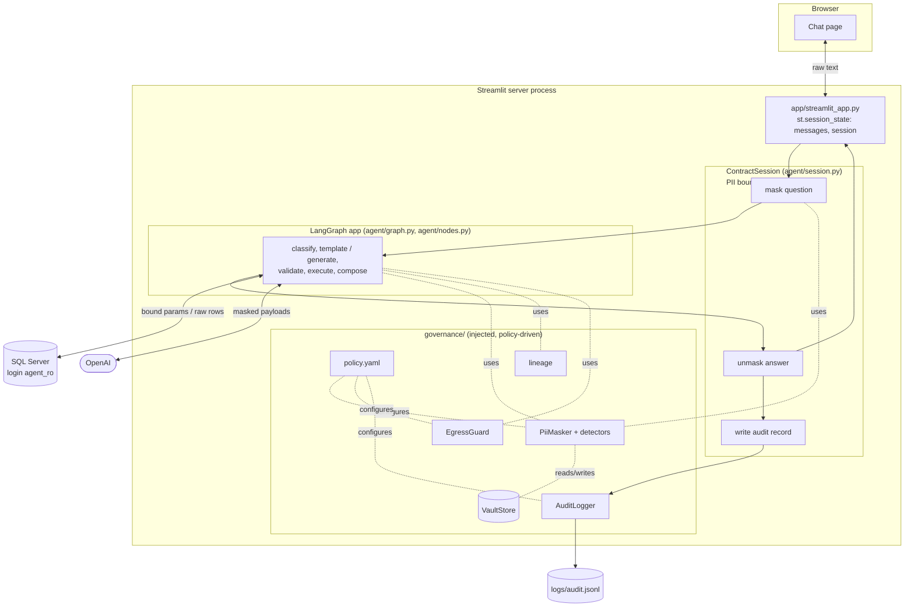
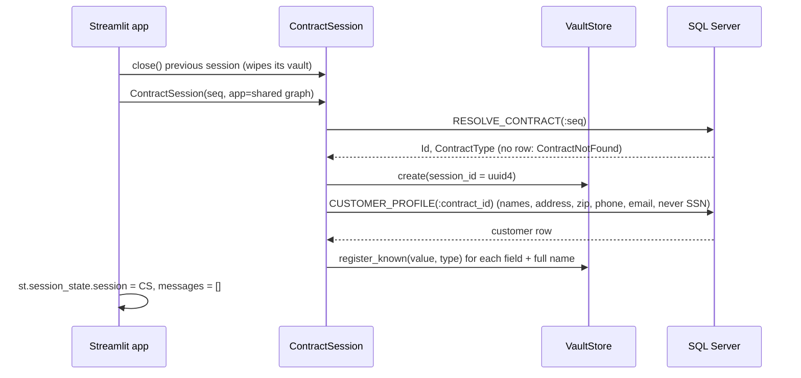
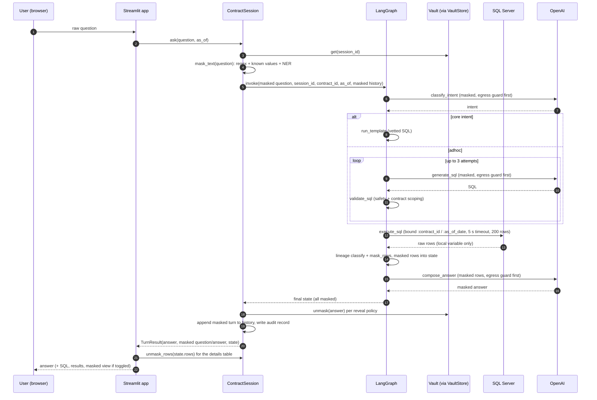

# Data flow

How a question travels from the Streamlit UI through the PII boundary, the LangGraph agent, SQL Server and OpenAI,
and back. Covers which component holds which data, where raw PII exists, and how governance is enforced outside
the graph's own logic.

Related: [PII implementation details](PII%20implementation%20details.md),
[SQLValidator using SQLGlot](SQLValidator%20using%20SQLGlot.md), [agent graph](agent_graph.png).

## 1. Components and layers

| Layer | Code | Responsibility | Sees raw PII? |
| --- | --- | --- | --- |
| UI | `app/streamlit_app.py` | Contract picker, chat, rendering, per-browser session lifecycle | Yes: it shows real values to the user |
| PII boundary | `agent/session.py` (`ContractSession`) | Resolve contract, load vault, mask question, run graph, unmask answer, audit | Yes, and it is the only layer that converts between raw and masked |
| Agent | `agent/graph.py`, `agent/nodes.py`, `agent/state.py` | Routing, SQL generation, validation, execution, answer composition | No, except transiently inside `execute_sql` before masking |
| Governance | `governance/*` | Policy, vault, detectors, masking, lineage, egress guard, audit | Holds the vault; masks and unmasks |
| Data access | `agent/db.py`, `agent/templates.py`, `agent/validator.py` | Read-only engine, vetted SQL, SQL safety and contract scoping | Database results only |
| External | SQL Server, OpenAI | System of record; language model | SQL Server: yes. OpenAI: never |

## 2. Lifecycle in Streamlit

### 2.1 Server start and first page load

| Step | Code | Shared by | Holds PII? |
| --- | --- | --- | --- |
| Load policy, build `PiiMasker`, warm up Presidio, compile the graph | `shared_agent()` with `@st.cache_resource` | All users of the server process | No: compiled graph, masker and detectors only |
| Load contract list (`LIST_CONTRACTS`) | `list_contracts()` with `@st.cache_data(ttl=300)` | All users, refreshed every 5 minutes | No: sequence number, type, status |

The compiled graph is stateless between calls (each `invoke` gets its own state), so one instance safely serves
all browser sessions.

### 2.2 Opening a session (contract selected)

Triggered when the selected contract differs from `st.session_state.seq`, or by **New conversation**.

After this, the vault knows the contract customer's values, so they are masked wherever they appear.

### 2.3 Closing a session

| Trigger | What happens |
| --- | --- |
| Contract switched or **New conversation** | `ContractSession.close()` → `VaultStore.close()` wipes the vault; `messages` reset |
| Browser tab closed | Streamlit discards `st.session_state`; the vault is purged by `VaultStore` after 1 hour idle |
| Vault expired, then the user asks again | `ask()` raises `KeyError`; the app opens a new session and asks the user to repeat the question |

## 3. One question, end to end

### 3.1 Worked example (CT-1003, customer Maria Lopez)

| Hop | Data |
| --- | --- |
| Browser → app | `What is Maria Lopez's phone number?` |
| Session → graph (`question`) | `What is <PERSON_1>'s phone number?` |
| Graph → OpenAI (`classify_intent`) | system prompt + `What is <PERSON_1>'s phone number?` → `adhoc` |
| Graph → OpenAI (`generate_sql`) | schema card + contract context + masked question |
| OpenAI → graph | `SELECT cu.Phone FROM dbo.Customers cu JOIN dbo.LoanFinances ln ON ln.CustomerId = cu.Id WHERE ln.ContractId = :contract_id` |
| Graph → SQL Server | the SQL with `contract_id = 3` bound |
| SQL Server → `execute_sql` | `[{"Phone": "555-0103"}]` (never stored) |
| `execute_sql` → state (`rows`) | `[{"Phone": "<PHONE_1>"}]`, `pii_columns = {"Phone": "PHONE"}` |
| Graph → OpenAI (`compose_answer`) | `Question: What is <PERSON_1>'s phone number? Query result (JSON rows): [{"Phone": "<PHONE_1>"}]` |
| OpenAI → graph (`answer`) | `<PERSON_1>'s phone number is <PHONE_1>.` |
| Session → app | `Maria Lopez's phone number is 555-0103.` |
| Session → audit log | masked question, SQL, `pii_input {PERSON: 1}`, `pii_masked_output {PHONE: 1}`, `pii_guard_masked {}`, LLM call sizes and hashes |

## 4. Graph state contract

`AgentState` (`agent/state.py`) is the only data passed between nodes. Every text field is masked.

| Field | Written by | Read by |
| --- | --- | --- |
| `session_id`, `sequence_number`, `contract_id`, `contract_type`, `as_of_date` | ContractSession (input) | all nodes |
| `question`, `history` | ContractSession (input, masked) | classify, generate, compose |
| `intent` | classify_intent | routing, run_template |
| `sql` | run_template, generate_sql | validate, execute |
| `sql_errors` | generate (clears), validate, execute | routing, generate (repair prompt) |
| `sql_attempts` | generate_sql | routing (retry limit) |
| `rows`, `pii_columns`, `pii_masked` | execute_sql (masked) | compose, ContractSession (audit), UI (details) |
| `answer` | compose_answer, give_up | ContractSession (unmask) |
| `llm_calls` | each LLM node; appended with an `operator.add` reducer | ContractSession (audit) |

Routing: `classify_intent` → `core` to `run_template` / `adhoc` to `generate_sql`; `validate_sql` → `valid` /
`retry` / `give up`; `execute_sql` → `ok` / `retry` (adhoc only) / `give up`. Retries are capped by
`max_sql_retries = 2`.

## 5. Governance independent of the graph

Governance is defined in `governance/`, configured by `governance/policy.yaml`, and attached to the agent in two ways.
The graph decides *what to ask*; it has no say over *what data it may see*.

### 5.1 Around the graph: the session boundary

These run entirely outside LangGraph and apply to any graph passed to `ContractSession`:

| Control | When |
| --- | --- |
| Contract resolution and vault creation | Session open |
| Customer profile loaded as known values | Session open |
| Question masking (`PiiMasker.mask_text` with NER) | Before `invoke` |
| Answer unmasking with reveal policy | After `invoke` |
| Masked conversation history | After `invoke` |
| Audit record (success, give-up and error) | After `invoke`, or on exception |

### 5.2 Injected into the graph: dependency injection

`build_graph(policy, masker, vaults, ...)` hands governance objects to `AgentNodes`. The nodes call them; they do not
implement them.

| Control | Injected object | Called from | Effect |
| --- | --- | --- | --- |
| Egress guard | `EgressGuard(masker, policy.guard_mode)` | `AgentNodes._call_llm`, the single path for every LLM call | Re-scans each outbound payload; masks (`mask`) or refuses (`block`) |
| Row masking | `PiiMasker.mask_rows` + `classify_output_columns` | `execute_sql`, right after fetching | Raw rows never reach state |
| Error masking | `PiiMasker.mask_text` | `execute_sql` on database errors | Values echoed in SQL Server errors are masked before the repair prompt |
| Vault lookup | `VaultStore.get(session_id)` | guard and row masking | Fails closed if the session is closed or expired |
| SQL safety and contract scoping | `validate_sql` (pure function; restricted columns from the policy) | `validate_sql` node | Only single-contract, read-only SELECTs run |

Rule for extending the graph: any new node that calls the LLM must go through `_call_llm`, and any new node that
fetches data must mask before returning. The leak tests (`tests/test_pii_leak.py`) catch violations, because they
inspect every payload the LLM receives.

### 5.3 Below the graph: the database

| Control | Where |
| --- | --- |
| Read-only login `agent_ro` (`db_datareader`) | SQL Server |
| `DENY SELECT ON dbo.Customers (SSN)` | SQL Server |
| Bound parameters, 5 s query timeout, 200-row cap, rollback after read | `agent/db.py` |

## 6. Where data lives

| Store | Contents | PII form | Lifetime | Scope |
| --- | --- | --- | --- | --- |
| Browser | Rendered chat | Raw (the user's own view) | Page lifetime | One user |
| `st.session_state.messages` | Displayed answers, SQL, unmasked result rows, masked view | **Raw** | Until new conversation, contract switch or browser session end | One browser session |
| `st.session_state.session` | The `ContractSession` | Masked history; raw only via the vault reference | Same as above | One browser session |
| `VaultStore` | Token ↔ value maps, known values | **Raw** | Until close or 1 hour idle | One ContractSession |
| `AgentState` | Masked question, history, SQL, rows, answer | Masked | One `invoke` | One question |
| `execute_sql` local variable | Fetched rows | Raw, transient | Milliseconds, never stored | One query |
| `st.cache_resource` / `st.cache_data` | Compiled graph, masker; contract list | None | Server process / 5 min | All users |
| `logs/audit.jsonl` | One record per question | Masked | Persistent | All sessions |
| OpenAI | Prompts and completions | Masked | Per OpenAI's data retention | External |
| SQL Server | System of record | Raw | Persistent | External |

Raw PII exists only in the browser, Streamlit's per-session memory, the vault, the transient fetch inside
`execute_sql`, and the database.

## 7. Trust boundaries

| Boundary | Direction | Data | Protection |
| --- | --- | --- | --- |
| Browser ↔ Streamlit | both | Raw question and answer | Local only today; add TLS and sign-in (`st.login`) before sharing |
| Streamlit ↔ ContractSession | in-process | Raw in, raw out | The session is the conversion point |
| ContractSession ↔ graph | in-process | Masked only | Masking before `invoke`, unmasking after |
| Graph ↔ SQL Server | both | Bound parameters out; raw rows in | `agent_ro`, validator scoping, masking at fetch |
| Graph ↔ OpenAI | both | Masked only | Input and row masking, then the egress guard on every call |
| Session ↔ audit log | out | Masked only | Records built from masked fields and counts |

## 8. Failure paths

| Failure | Where | User sees | Audit |
| --- | --- | --- | --- |
| Unknown contract | Session open | Error in the app | None (no session) |
| Database unreachable at page load | `list_contracts` | "Cannot reach the database" | None |
| Unsafe SQL after 2 retries | `validate_sql` → `give_up` | "I couldn't build a safe query..." | `outcome: gave_up`, errors |
| Database error on a core template | `execute_sql` → `give_up` | Same | `outcome: gave_up` |
| Database error on ad-hoc SQL | `execute_sql` → `generate_sql` (masked error text) | Answer, if repair succeeds | `sql_attempts > 1` |
| OpenAI error or timeout | Any LLM node | "Sorry, something went wrong" | `outcome: error`, exception type |
| Egress guard in `block` mode finds PII | `_call_llm` raises `PiiLeakError` | "Sorry, something went wrong" | `outcome: error`, `PiiLeakError` |
| Vault expired | `ContractSession.ask` | "This conversation expired..." | None for that attempt |

## 9. Concurrency

| Shared object | Safe because |
| --- | --- |
| Compiled graph | Stateless between `invoke` calls; state is per call |
| `VaultStore` | Lock around create, get, close and purge; one vault per session id |
| `AuditLogger` | Lock around file appends |
| SQLAlchemy engine | Connection pool with pre-ping; one connection per query |
| Presidio analyzer | Loaded once (`lru_cache`) and used read-only |

Streamlit runs each browser session in its own thread, so concurrent users share these objects but not sessions or
vaults.

## 10. Code map

| Concern | File |
| --- | --- |
| UI and session lifecycle | `app/streamlit_app.py` |
| PII boundary, audit record assembly | `agent/session.py` |
| Graph wiring and routing | `agent/graph.py` |
| Node logic, LLM call wrapper | `agent/nodes.py` |
| State contract | `agent/state.py` |
| Vetted SQL, customer profile, contract list | `agent/templates.py` |
| SQL safety and contract scoping | `agent/validator.py`, `agent/schema.py` |
| Database access | `agent/db.py` |
| Policy | `governance/policy.yaml`, `governance/policy.py` |
| Vault | `governance/vault.py` |
| Detection and masking | `governance/detectors.py`, `governance/masker.py` |
| Output column lineage | `governance/lineage.py` |
| Egress guard | `governance/guard.py` |
| Audit log | `governance/audit.py` |
